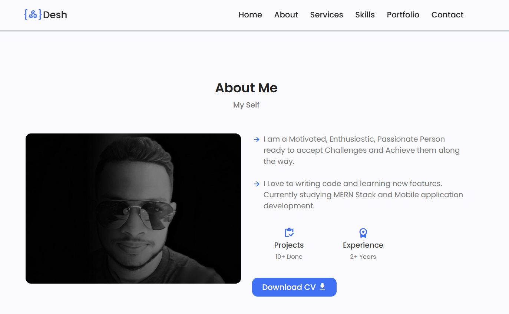
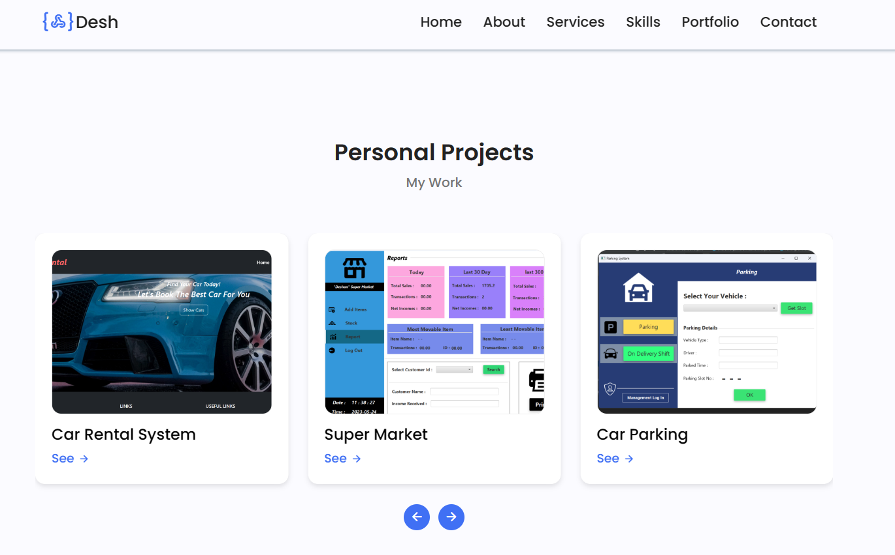

# Portfolio Website

### Description

* A Responsive Personal Portfolio Website Using HTML CSS& Javascript. To See Just Click 😜 : <code><a href="https://deshangithub.github.io/My-Profile/">Click here</a></code>

* This repository has a folder called ***myProjects*** that contains some of my class assignments and projects.

### Contents of the *myProject* folder

* Internet Technology Class Assignments
* JavaEE POS
* SPA POS
* 2D Game
* Tesla Model Y Web page

### Purpose 

* This portfolio website is built to enhance web designing knowledge and it shows some information about my career.
I categorized them into sections.

## Built With
#### Languages

• HTML  
• CSS  
• JavaScript  

####  Libraries

• jQuery  

#### Fonts

• Google Font  

#### Icons

• Google Icon  
• Jam Icon  

# Reference Links
📍 Site-Map: https://www.gloomaps.com/9wt6sg4v6J

️️🖼️ Mock Up: https://www.figma.com/file/71NPEbqeZ4payTvHpw2d2l/Untitled?type=design&node-id=0%3A1&t=UI4TK9IbRION0WbO-1

📃 GitHub Page URL: https://deshangithub.github.io/My-Profile/

🔗 Linked-in URL: https://www.linkedin.com/in/kavindu-deshan-chandrasiri/

